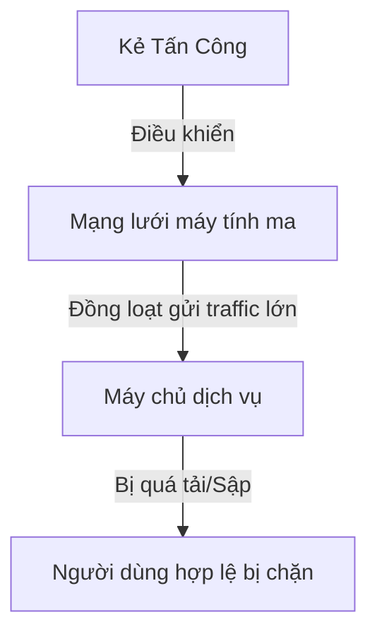

# BÁO CÁO TÌM HIỂU VỀ DDoS VÀ IDS

Báo cáo này cung cấp cái nhìn tổng quan, dễ hiểu về hai khái niệm cơ bản nhưng cực kỳ quan trọng trong an ninh mạng: **Tấn công từ chối dịch vụ phân tán (DDoS)** và **Hệ thống phát hiện xâm nhập (IDS)**.

---

## PHẦN 1: TÌM HIỂU VỀ TẤN CÔNG DDoS

### 1. DDoS là gì?
*   **DDoS (Distributed Denial of Service - Tấn công từ chối dịch vụ phân tán):** Là hành vi làm tê liệt một trang web, máy chủ hoặc hệ thống mạng bằng cách làm ngập lụt hệ thống đó với lượng truy cập (traffic) cực lớn từ nhiều nguồn khác nhau.
*   **Điểm khác biệt giữa DoS và DDoS:**
    *   **DoS (Denial of Service):** Tấn công từ **một nguồn** duy nhất. Dễ dàng ngăn chặn bằng cách chặn địa chỉ IP của nguồn đó.
    *   **DDoS (Distributed DoS):** Tấn công từ **nhiều nguồn** phân tán trên toàn cầu (thường là mạng lưới máy tính ma - **Botnet** đã bị cài mã độc). Việc chặn thủ công từng IP là cực kỳ khó khăn.

### 2. Các loại tấn công DDoS phổ biến
Tấn công DDoS thường được chia làm 3 dạng chính:

*   **Tấn công băng thông (Volumetric Attacks):**
    *   *Mục đích:* Làm đầy nghẹt đường truyền Internet kết nối tới máy chủ.
    *   *Cách thức:* Gửi lượng dữ liệu khổng lồ (thường sử dụng gói tin UDP hoặc ICMP) khiến băng thông bị quá tải. Người dùng bình thường không thể truy cập vì đường truyền đã bị chiếm hết.
*   **Tấn công giao thức (Protocol Attacks):**
    *   *Mục đích:* Làm cạn kiệt tài nguyên xử lý của thiết bị mạng (Router, Firewall) hoặc máy chủ.
    *   *Ví dụ:* **SYN Flood** – Kẻ tấn công gửi liên tục các yêu cầu kết nối TCP (SYN) giả mạo nhưng không bao giờ hoàn thành quá trình bắt tay. Máy chủ phải tốn bộ nhớ để chờ kết nối này cho tới khi hết tài nguyên.
*   **Tấn công lớp ứng dụng (Application Layer Attacks):**
    *   *Mục đích:* Tấn công trực tiếp vào ứng dụng web (HTTP/HTTPS).
    *   *Cách thức:* Gửi các yêu cầu trông giống như người dùng thật (ví dụ như liên tục tải một trang web nặng hoặc thực hiện tìm kiếm cơ sở dữ liệu phức tạp) làm máy chủ web xử lý quá tải và treo.

---

## PHẦN 2: TÌM HIỂU VỀ HỆ THỐNG PHÁT HIỆN XÂM NHẬP (IDS)

### 1. IDS là gì?
*   **IDS (Intrusion Detection System - Hệ thống phát hiện xâm nhập):** Là một giải pháp phần mềm hoặc phần cứng giám sát lưu lượng mạng và các hoạt động của hệ thống để phát hiện các dấu hiệu nghi ngờ hoặc truy cập trái phép.
*   **IDS chỉ cảnh báo, không ngăn chặn:** Khi phát hiện bất thường, IDS sẽ ghi log và gửi cảnh báo đến quản trị viên. Khác với **IPS (Intrusion Prevention System)** là hệ thống vừa phát hiện vừa chủ động ngăn chặn cuộc tấn công ngay lập tức.

### 2. Phân loại IDS theo vị trí lắp đặt
*   **NIDS (Network-based IDS):**
    *   Được đặt ở các điểm nút của mạng để giám sát tất cả lưu lượng dữ liệu đi vào và đi ra của cả hệ thống mạng.
    *   *Ưu điểm:* Bảo vệ được toàn bộ các máy trong mạng.
*   **HIDS (Host-based IDS):**
    *   Được cài đặt trực tiếp trên một máy chủ cụ thể (ví dụ: máy chủ cơ sở dữ liệu quan trọng).
    *   *Ưu điểm:* Giám sát sâu các file hệ thống, log của máy chủ đó xem có ai chỉnh sửa trái phép hay không.

### 3. Phân loại IDS theo cách phát hiện tấn công
*   **Phát hiện dựa trên chữ ký (Signature-based IDS):**
    *   *Cách hoạt động:* Giống như phần mềm diệt virus. Nó so sánh dữ liệu mạng với một danh sách các mẫu tấn công đã biết từ trước (chữ ký).
    *   *Ưu điểm:* Chính xác cao với các cuộc tấn công đã biết, ít báo động nhầm.
    *   *Nhược điểm:* Hoàn toàn không phát hiện được các cuộc tấn công mới chưa có trong cơ sở dữ liệu (tấn công Zero-day).
*   **Phát hiện dựa trên bất thường (Anomaly-based IDS):**
    *   *Cách hoạt động:* Hệ thống sẽ học hành vi hoạt động "bình thường" của mạng. Khi thấy có sự thay đổi đột biến (ví dụ: lượng truy cập tăng vọt đột ngột), nó sẽ phát cảnh báo.
    *   *Ưu điểm:* Phát hiện được các cuộc tấn công mới chưa từng ghi nhận.
    *   *Nhược điểm:* Dễ báo động nhầm (ví dụ: khi có đợt khuyến mãi, người dùng thật truy cập đông cũng bị coi là bất thường).

---

## MỐI LIÊN HỆ GIỮA DDoS VÀ IDS
Trong thực tế bảo mật, hệ thống **IDS** đóng vai trò như một "trạm gác" giúp phát hiện sớm các dấu hiệu của cuộc tấn công **DDoS**. Ví dụ, khi NIDS nhận thấy số lượng kết nối nửa mở (SYN) tăng đột biến hoặc băng thông tăng nhanh một cách bất thường, nó sẽ phát cảnh báo kịp thời để quản trị viên hoặc hệ thống IPS tự động kích hoạt các biện pháp phòng vệ (như chặn IP hoặc định tuyến lại traffic).
