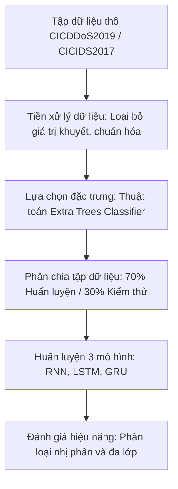

# Nhận diện tấn công DDoS trong lưu lượng mạng bằng Học sâu: Phân tích và Đánh giá Mô hình

Bài viết này thực hiện phân tích và tóm tắt quy trình nghiên cứu khoa học từ mục tiêu, phương pháp tiền xử lý dữ liệu, thiết lập huấn luyện cho đến kết quả thực nghiệm của đề tài phát hiện tấn công từ chối dịch vụ phân tán (DDoS) sử dụng các mô hình học sâu.

---

## 1. Giới thiệu và Mục tiêu nghiên cứu
Sự phát triển mạnh mẽ của Internet và điện toán đám mây đi kèm với những thách thức lớn về an ninh mạng, đặc biệt là các cuộc tấn công từ chối dịch vụ (DoS) và từ chối dịch vụ phân tán (DDoS). Các giải pháp phòng thủ truyền thống, chẳng hạn như tường lửa hoặc hệ thống phát hiện xâm nhập dựa trên luật (IDS), thường gặp khó khăn trong việc phát hiện các biến thể tấn công DDoS phức tạp và tinh vi ngày nay.

Để giải quyết vấn đề này, hướng tiếp cận ứng dụng Học sâu vào phân tích lưu lượng mạng đã được đề xuất nhằm tự động nhận diện các hành vi bất thường. Nghiên cứu này tập trung phân tích, huấn luyện và so sánh hiệu năng của ba kiến trúc mạng nơ-ron hồi quy phổ biến bao gồm:
*   **Mạng nơ-ron hồi quy (RNN)**
*   **Mạng bộ nhớ dài-ngắn hạn (LSTM)**
*   **Đơn vị hồi quy có cổng (GRU)**

Mục tiêu cốt lõi của nghiên cứu là đánh giá khả năng phân loại lưu lượng mạng (nhị phân và đa lớp) nhằm tìm ra kiến trúc tối ưu nhất phục vụ cho các hệ thống phát hiện xâm nhập thời gian thực.

---

## 2. Quy trình thực hiện

Quy trình nghiên cứu được triển khai một cách hệ thống qua các giai đoạn từ thu thập dữ liệu, tiền xử lý, lựa chọn đặc trưng cho đến thiết lập và huấn luyện mô hình.

### 2.1. Bộ dữ liệu nghiên cứu
Nghiên cứu sử dụng hai bộ dữ liệu chuẩn thức của Viện An ninh mạng Canada (CIC):
*   **CICDDoS2019:** Bộ dữ liệu chứa lưu lượng mạng thời gian thực của 12 loại hình tấn công DDoS khác nhau, phản ánh chân thực các kịch bản tấn công hiện đại.
*   **CICIDS2017:** Được sử dụng làm tập dữ liệu đối chứng để so sánh và kiểm chứng tính tổng quát của các mô hình đã đề xuất.

### 2.2. Tiền xử lý dữ liệu
Để tối ưu hóa hiệu quả học tập của mô hình và giảm thiểu sai số, dữ liệu thô được chuẩn hóa qua các bước:
*   **Xử lý giá trị khuyết thiếu:** Loại bỏ toàn bộ các dòng chứa giá trị rỗng hoặc không xác định nhằm đảm bảo tính toàn vẹn của dữ liệu đầu vào.
*   **Mã hóa dữ liệu:** Chuyển đổi các đặc trưng dạng phân loại sang dạng số bằng cách sử dụng kỹ thuật mã hóa nhãn kết hợp với mã hóa một nóng (One-hot).
*   **Chuẩn hóa dữ liệu:** Áp dụng phương pháp chuẩn hóa Standard Scaler để đưa các đặc trưng về cùng một phân phối chuẩn (trung bình bằng 0 và độ lệch chuẩn bằng 1), ngăn ngừa hiện tượng các đặc trưng có thang đo lớn áp đảo các đặc trưng khác.
*   **Lựa chọn đặc trưng:** Thay vì huấn luyện trên toàn bộ các thuộc tính của gói tin, nhóm tác giả sử dụng thuật toán bộ phân loại cây cực hạn (Extra Trees) để đánh giá tầm quan trọng và lọc ra **20 đặc trưng có giá trị phân loại cao nhất**. Điều này giúp giảm thiểu đáng kể chi phí tính toán và thời gian huấn luyện.
*   **Phân chia dữ liệu:** Tập dữ liệu được phân chia theo tỷ lệ 70% dành cho quá trình huấn luyện và 30% dành cho kiểm thử.

### 2.3. Cấu hình huấn luyện mô hình
Các mô hình RNN, LSTM và GRU được thiết lập với các tham số cấu hình đồng nhất để đảm bảo tính khách quan khi so sánh:
*   **Bộ tối ưu hóa:** Sử dụng thuật toán Adam với tốc độ học là 0.001.
*   **Kích thước lô (Batch Size):** 1000 mẫu trên mỗi chu kỳ lặp.
*   **Kiểm soát quá khớp:** Sử dụng hàm kích hoạt chỉnh lưu tuyến tính (ReLU) trong các lớp ẩn, kết hợp với kỹ thuật loại bỏ nơ-ron ngẫu nhiên (Dropout) và cơ chế dừng sớm (Early Stopping) khi hàm mất mát trên tập kiểm thử không còn cải thiện.

---

## 3. Kết quả thực nghiệm và đánh giá

Hiệu năng của ba mô hình được đánh giá chi tiết trên hai bài toán: **Phân loại nhị phân** (chỉ nhận diện "Lưu lượng bình thường" hoặc "Tấn công") và **Phân loại đa lớp** (phân biệt chính xác giữa 12 loại hình tấn công DDoS cụ thể).

| Phương thức phân loại | Chỉ số đánh giá | RNN | LSTM | GRU |
| :--- | :--- | :--- | :--- | :--- |
| **Phân loại nhị phân** | **Độ chính xác** | 99,99% | 99,99% | 99,99% |
| | **Thời gian thực thi** | 10 phút | 1 phút 17 giây | **47,9 giây** |
| **Phân loại đa lớp** | **Độ chính xác** | 99,15% | 99,43% | **99,54%** |
| | **Thời gian thực thi** | 4 phút | 16 phút 30 giây | 7 phút 3 giây |

### 3.1. Phân tích kết quả phân loại nhị phân
Trong bài toán phân loại nhị phân, cả ba kiến trúc mạng nơ-ron đều đạt độ chính xác gần như tuyệt đối (99,99%). Tuy nhiên, các mô hình thể hiện sự khác biệt rõ rệt về hiệu suất thời gian và tỷ lệ sai số:
*   **Mô hình RNN:** Mặc dù mất nhiều thời gian huấn luyện nhất (10 phút), RNN lại đem lại sự ổn định vượt trội khi có tỷ lệ dương tính giả và âm tính giả ở mức thấp nhất.
*   **Mô hình GRU:** Đạt hiệu năng tối ưu nhất về mặt tài nguyên tính toán khi hoàn thành quá trình huấn luyện và dự đoán chỉ trong **47,9 giây**. Khả năng tính toán nhanh giúp GRU trở thành ứng cử viên sáng giá để tích hợp vào các hệ thống phát hiện xâm nhập (IDS) thời gian thực, nơi tốc độ xử lý là yếu tố quyết định.

### 3.2. Phân tích kết quả phân loại đa lớp
Đối với bài toán phân loại đa lớp (phân biệt chi tiết 12 loại hình tấn công DDoS):
*   **Mô hình GRU:** Chiếm ưu thế hoàn toàn với độ chính xác cao nhất (99,54%) đồng thời có tỷ lệ phân loại sai thấp nhất. Thời gian huấn luyện của GRU (7 phút 3 giây) chỉ bằng một nửa so với LSTM (16 phút 30 giây), thể hiện sự tối ưu vượt trội của cấu trúc cổng tối giản trong GRU đối với các tác vụ phân loại phức tạp.

---

## 4. Kết luận
Nghiên cứu đã khẳng định tính khả thi và hiệu quả vượt trội của việc ứng dụng các thuật toán Học sâu trong giám sát và bảo mật an toàn thông tin mạng. Từ các kết quả thực nghiệm, chúng ta có thể rút ra một số định hướng lựa chọn mô hình cụ thể:
1.  **Mô hình RNN:** Phù hợp với các kịch bản phân loại nhị phân yêu cầu độ tin cậy cực cao và giảm thiểu tối đa sai số cảnh báo nhầm, tại các môi trường mạng có tài nguyên máy tính đủ đáp ứng.
2.  **Mô hình GRU:** Là giải pháp toàn diện và tối ưu nhất cho cả bài toán phân loại nhị phân lẫn đa lớp. Nhờ tốc độ xử lý vượt trội và yêu cầu tài nguyên tính toán thấp hơn so với LSTM, GRU đáp ứng tốt các yêu cầu của các hệ thống cảnh báo và ngăn chặn tấn công thời gian thực.
